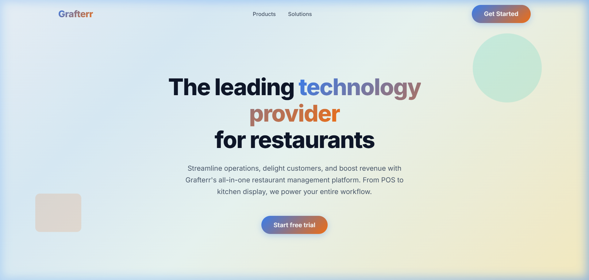
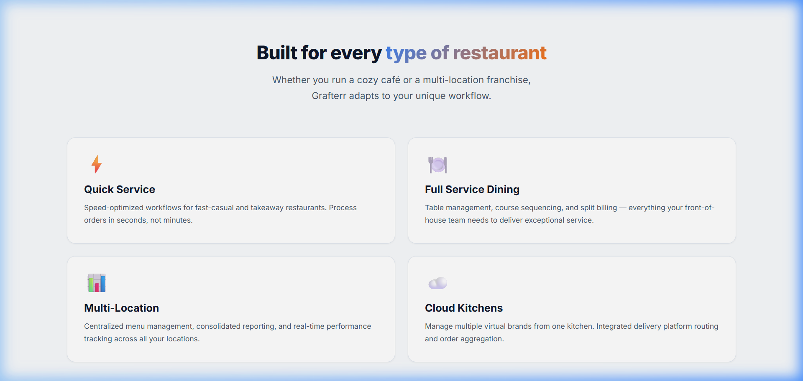

# Grafterr Landing Page

A pixel-perfect, fully responsive React landing page for **Grafterr** — a modern restaurant technology platform.

## 🔗 Links
- **Live Deployed URL**: https://grafterr-landing-page.netlify.app/

## 🛠️ Chosen Stack
- **Framework**: React 18 (Functional Components & Hooks)
- **Build Tool**: Vite (for lightning-fast development and optimized builds)
- **Styling**: Vanilla CSS with **CSS Modules** (zero frameworks used for pixel-perfection)
- **Data Management**: Data-driven architecture using a central `content.json`
- **Quality**: PropTypes for type safety and clean component interfaces

## 🚀 Setup Instructions

```bash
# 1. Clone the repository
git clone https://github.com/kaustubhraut2001/Grafterr-Landing-Page.git

# 2. Navigate to project directory
cd Grafterr-Landing-Page

# 3. Install dependencies
npm install

# 4. Run development server
npm run dev
```

The application will be available at `http://localhost:5173`.

## 🧠 Approach & Methodology

1.  **Architecture**: Followed a strictly modular approach. UI components are separated into `ui/` atoms (Input, Button, Card) and `sections/` organisms (Hero, Features, Solutions).
2.  **Data-Driven**: All text content is hosted in `src/data/content.json`. This allows for content updates without touching the JSX, simulating a CMS-ready environment.
3.  **Simulated API**: Implemented a realistic API layer in `src/services/api.js` that mimics network latency and handles random failure states (15% rate) to test the robustness of the UI.
4.  **Custom Hooks**:
    - `useContent`: Orchestrates parallel data fetching and state management.
    - `useCarousel`: Encapsulates complex carousel logic including touch gestures and boundary checks.
5.  **Aesthetics**: Focused on premium design with:
    - Custom CSS animations for floating shapes.
    - Shimmer skeletons for improved perceived performance.
    - Glassmorphism effects and consistent brand gradients.

## 📸 Screenshots

### Hero Section


### Features & Carousel


### Solutions Grid


### Interactive Modal (Signup & Success)
| Signup Form | Success Message |
|---|---|
|  |  |

## ⚖️ Implementation vs Figma Comparison

| Feature | Implementation Detail |
|---|---|
| **Typography** | Inter (400-800) matched from design |
| **Colors** | Gradient `#3B82F6` to `#F97316` applied consistently |
| **Grid** | Responsive 1/2/3 column layout based on device breakpoints |
| **Interactions** | Smooth scrolling, hover lift animations, and touch-ready carousel |

> _[Insert Side-by-Side Comparison Image Here]_

## 📁 Project Structure

```
grafterr-landing/
├── public/images/              # Brand assets & generated product images
├── screenshots/                # Documentation screenshots
├── src/
│   ├── components/
│   │   ├── ui/                 # Reusable atomic components
│   │   └── sections/           # High-level page sections
│   ├── hooks/                  # Logic-only reusable hooks
│   ├── services/               # API & Network layer
│   ├── data/                   # content.json (Single Source of Truth)
│   ├── styles/                 # Global variables & Design tokens
│   ├── App.jsx                 # state orchestration
│   └── main.jsx                # Entry point
```