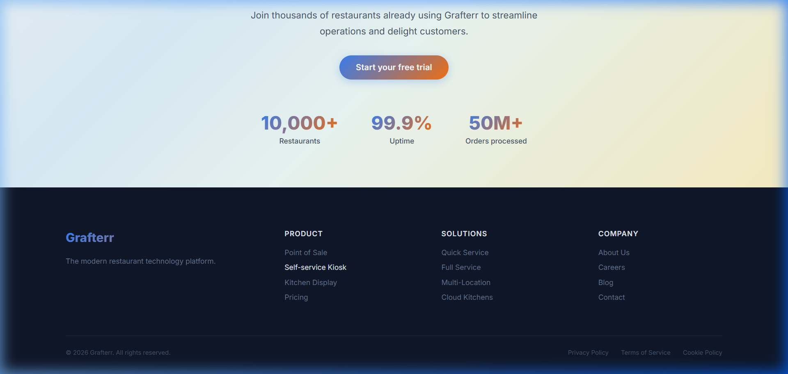

# Grafterr Landing Page

A pixel-perfect, fully responsive React landing page for **Grafterr** — a modern restaurant technology platform.

## Screenshots

### Hero Section
Gradient hero with animated floating shapes, smooth-scroll navigation, and CTA buttons.


---

### Features Section
Product carousel with 3 cards (POS, Self-service Kiosk, Kitchen Management) featuring gradient tag badges, hover effects, and responsive layout.


---

### Solutions Section
2×2 grid showcasing restaurant types — Quick Service, Full Service Dining, Multi-Location, and Cloud Kitchens.


---

### CTA Section & Footer
Stats bar (10,000+ Restaurants, 99.9% Uptime, 50M+ Orders), gradient CTA button, and dark-themed footer with multi-column navigation.



---

### Signup Modal
Fully functional modal with form validation, loading state, and animated success confirmation.

| Signup Form | Success State |
|---|---|
|  |  |

---

## Tech Stack

| Technology | Purpose |
|---|---|
| **React 18** | UI framework — functional components + hooks only |
| **Vite** | Build tool and dev server for fast HMR |
| **CSS Modules** | Scoped, modular styling — no CSS frameworks |
| **PropTypes** | Runtime type checking for all components |

## Architecture

- **Data-driven UI**: All visible text comes from `src/data/content.json` via a simulated API layer (`src/services/api.js`). Zero hardcoded text in JSX.
- **Custom hooks**: `useContent` manages parallel data fetching with loading/error/retry states. `useCarousel` handles carousel navigation with touch swipe support.
- **Skeleton loading**: Every section renders animated shimmer placeholders while data loads.
- **Error resilience**: The API simulates ~15% failure rate. The app catches errors and offers a retry button.
- **Responsive design**: Mobile-first with breakpoints at 768px (tablet) and 1024px (desktop). Carousel adapts items-per-view automatically.

## Setup

```bash
# Install dependencies
npm install

# Start development server
npm run dev
```

The app will be available at `http://localhost:5173`.

## Project Structure

```
grafterr-landing/
├── public/images/              # Static assets (logo, product images)
├── screenshots/                # README screenshots
├── src/
│   ├── components/
│   │   ├── ui/                 # Reusable UI (GradientText, ProductCard, Carousel, Modal, etc.)
│   │   └── sections/           # Page sections (Hero, Features, Solutions, CTA, Footer)
│   ├── hooks/                  # Custom hooks (useContent, useCarousel)
│   ├── services/               # API layer with simulated network delay
│   ├── data/                   # Content JSON — single source of truth for all text
│   ├── styles/                 # Global styles and CSS custom properties
│   ├── App.jsx                 # Root component with state orchestration
│   └── main.jsx                # Entry point
```

## Key Features

- ✅ **Smooth scroll navigation** — Products & Solutions links scroll to their sections
- ✅ **Working signup modal** — Form with validation, loading state, and success animation
- ✅ **Carousel with touch support** — Swipe gestures on mobile, arrow buttons on desktop
- ✅ **Loading skeletons** — Shimmer animation placeholders for every section
- ✅ **Error handling** — Retry button on API failures
- ✅ **Responsive** — Adapts from 375px mobile to 1440px desktop
- ✅ **Animated floating shapes** — 4s ease-in-out infinite bob animation
- ✅ **Fade-in transitions** — Content animates in on load